

	
<b>UNIVERSITÀ DEGLI STUDI DI SALERNO</b>

	
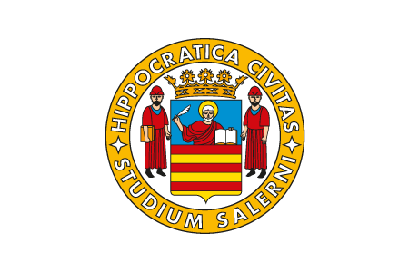

	
<b>DIPARTIMENTO DI INFORMATICA</b>

	
Corso di Laurea Magistrale

	
Progetto per il corso di Intelligenza Artificiale

	

	
<b>AISearchImage: SVILUPPO E PROGETTAZIONE DI UN MOTORE DI RICERCA DI SERVIZI INTELLIGENTE</b>

	<table style="display:inline-table; width:90%; position:relative;text-align:center;">
		<thead>
			<tr><td>Professori</td><td>Studenti</td></tr>
		</thead>
		<tbody>
			<tr><td>Vincenzo Deufemia</td><td>Lorenzo Valente</td></tr>
			<tr><td>Giuseppe Polese</td><td>Sergio Guastaferro</td></tr>
		</tbody>
	</table>
	
Anno Accademico 2017/2018

------------------------------------------------------

# Sommario

- [AISearchImage](#aisearchimage)
  * [Raccolta dei requisiti](#raccolta-dei-requisiti)
  * [Use Case: un esempio di ricerca](#use-case--un-esempio-di-ricerca)
  * [Modello ad oggetti e decomposizione in sottosistemi](#modello-ad-oggetti-e-decomposizione-in-sottosistemi)
  * [Diagramma di deployment](#diagramma-di-deployment)
  * [Esempio d'uso del sistema](#esempio-d-uso-del-sistema)
- [Bibliografia e Sitografia](#bibliografia-e-sitografia)

# AISearchImage

AISearchImage è un sistema intelligente che assiste l'utente nella
ricerca di servizi associati ad oggetti presenti in una immagine.

Presa l'immagine in input, viene fatta una prima fase di ricognizione
dell'oggetto presente grazie all'utilizzo di una rete neurale,
successivamente viene determinata la classe di appartenenza
dell'oggetto riconosciuto e viene recuperato il tipo di servizio
associato.

Tale sistema è consultabile su differenti tipi di *device* grazie ad
un'architettura basata sullo stile architetturale *REST-like*

Nelle seguenti sezioni del capitolo si discuteranno gli aspetti
progettuali dell'applicativo.

## Raccolta dei requisiti

Evidenziamo di seguito i requisiti funzionali del sistema:

-   **Ottenimento di una foto**

Il dispositivo che ospita il *frontend* deve essere in grado di scattare
una foto o di poterla prelevare da fonti esterne.

-   **Riconoscimento di oggetti in foto**

Il *backend*, il quale riceve una foto in ogni richiesta da parte del
*frontend*, deve essere in grado di poter riconoscere l\'oggetto
presente.

-   **Ottenere informazioni su servizi esterni**

Il sistema deve essere in grado di ottenere informazioni da siti esterni
circa i servizi usufruibili sull\'oggetto riconosciuto in foto.

Per quanto riguarda i requisiti non funzionali sono stati prefissati i
seguenti come guida nella progettazione :

-   **Prestazione**

Il sistema deve essere sempre in grado di eseguire il lavoro in tempi
brevi al variare del carico di lavoro degli utenti.

-   ***Smart e Crossplatform***

Il sistema deve essere in grado di lavorare su dispositivi smart ed
offrire una interfaccia simile sulle varie tipologie di User Experience.

-   **Modularità e Portabilità**

Il sistema dovrà essere portabile su vari ambienti e servizi garantendo
la modularità e la manutenibilità.

## Use Case: un esempio di ricerca

AISearchImage è accessibile da qualsiasi browser. Una volta fatto
l'accesso al servizio, verrà presentato all'utente la seguente
interfaccia.

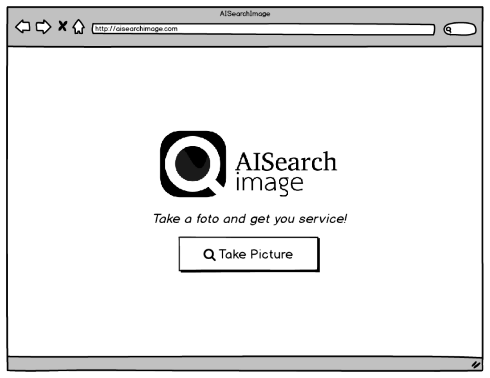

A questo punto l'utente potrà importare un'immagine che vuole
riconoscere mediante il pulsante "Take Picture".

Una volta importata l'immagine, essa verrà riconosciuta, successivamente
verrà visualizzata sia la categoria di appartenenza dell'immagine e sia
eventuali servizi associati ad essa. Ad esempio, un utente che carica
l'immagine di un fiore potrebbe essere interessato anche all'acquisto di
terriccio o semi, pertanto AISearchImage darà loro questa possibilità
come mostrato nell'immagine seguente.

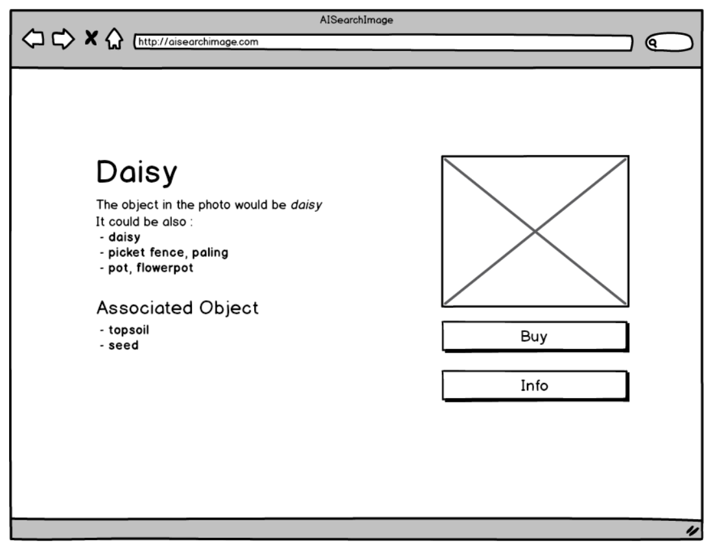

L'utente a questo punto può scegliere se avere ulteriori informazioni
sull'oggetto riconosciuto nell'immagine o se vuole acquistare un
prodotto simile; in quest'ultimo caso, gli saranno mostrate varie scelte
di prodotti che si avvicinano per somiglianza all'oggetto dell'immagine.

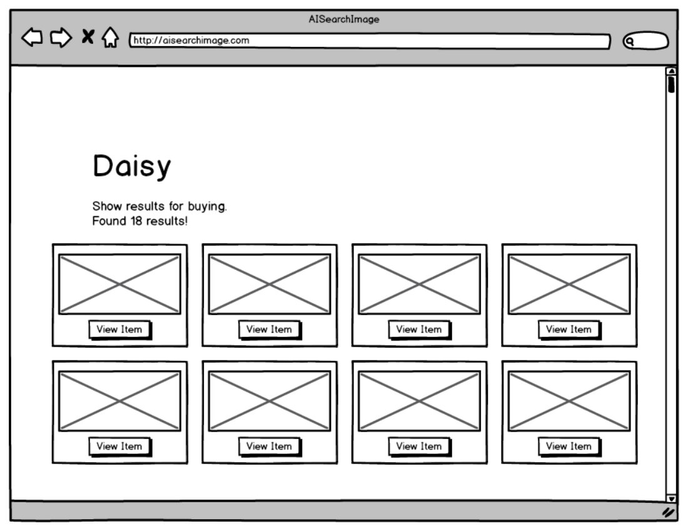

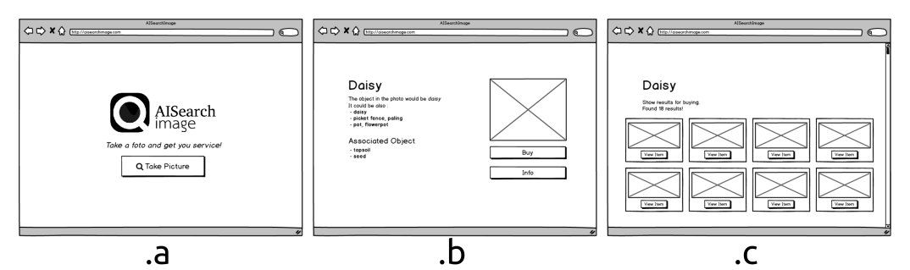

Figura 11. Figura riassuntiva dei mockups

## Modello ad oggetti e decomposizione in sottosistemi

Nel ***presentation layer*** sono presenti tutti gli *endpoint* delle
API che dovranno gestire le richieste da parte dei client; al suo
interno sono presenti :

-   ***Recognition***

Questo servizio riceve l'immagine scattata dall'utente ed esegue la fase
di *object recognition* e categorizza l\'oggetto ricevuto, memorizzando
il risultato in una sessione;

-   ***ShowResults***

Questo servizio mostra i risultati di un'azione da applicare
all\'oggetto riconosciuto in fase di ricezione.

-   ***AssociatedObjects***

In questo servizio si mostra all\'utente i risultati di un'operazione
inerente ad un oggetto associato a quello riconosciuto.

È possibile vedere lo schema della *route* del sistema e il
*presentation layer* nelle seguenti immagini.

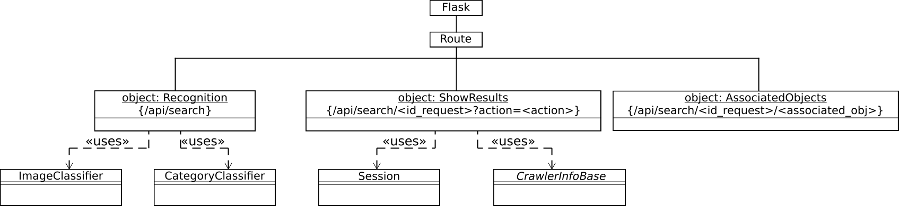

Figura 12. Schema della route del sistema

Figura 13. Presentation layer

Nel ***business layer*** sono presenti i seguenti sottosistemi :

-   ***ImageClassifier***

Utilizza la rete neurale *Inception V3* per effettuare la *Object
Recognition*. Fornisce un metodo *run\_inferece\_on\_image* che, presa
in input un'immagine, definisce la classe di appartenenza dell'oggetto
restituendo l\'identificativo wordnet associato.

-   ***CategoryClassifier***

Definisce la categoria di appartenenza dell'oggetto riconosciuto
mediante il metodo *find\_category*, in più, mappa i servizi associati
alle categorie, accessibili mediante il metodo
*get\_services\_by\_object* ed il relativo *crawler* associato
attraverso il metodo *get\_crawler\_service*. Gli oggetti associati ed i
relativi servizi sono poi mappati allo stesso modo e accessibili
rispettivamente mediante i metodi *get\_associated\_objects* e
*get\_tag\_url\_associated\_obj*

-   ***Session***

Questo sottosistema memorizza i risultati di una richiesta, in
particolare il risultato della *object recognition* e anche
dell'immagine spedita dal client. In particolare, è possibile salvare
ed accedere all\'immagine della richiesta mediante i rispettivi metodi
*saveImg* e *getPathImg*, rinominare eventualmente l\'identificativo
della sessione mediante il metodo *rename* ed accedere ai dati mediante
i metodi *set*, *get*, *getAll*.

-   ***CrawlerInfoBase***

Questo sottosistema definisce i *crawler* che prendono in input la
sessione ed analizzano i contenuti in rete (*web-service o web-site* )
da cui estrarre dati in maniera dinamica. Ogni sottoclasse definisce un
particolare *crawler* per lo specifico servizio associato che potrà
essere invocato mediante il metodo *run*. Il risultato ottenuto dal
*crawler* può essere di vario tipo ed è definito mediante
**TypeResult**: in generale, abbiamo due tipologie di risultati:
*ITEMS*, ossia un insieme di coppie *(immagine, link)*, e una
redirezione *REDIRECT*.

-   ***SIFTImageCompare***

Il sottosistema permette di comparare la somiglianza tra una immagine in
input *sourceImg* ed una immagine *queryImg*.

In particolare è possibile comparare immagini sia presenti in locale
attraverso il metodo *compareFromPATH* e sia presenti in Internet con il
metodo *compareFromURL*. Per entrambe le operazioni è possibile eseguire
una versione parallelizzata ( *multipleCompareFromPATH* e
*multipleCompareFromURL* ).

È possibile vedere lo schema del classificatore di immagini, del
classificatore di categorie e del *business layer* nelle seguenti
immagini.

Figura 14. Schema classificatore immagini e schema classificatore
categorie

Figura 15. Business layer

Nel ***library layer*** invece sono presenti tutte le librerie usate:

-   **TensorFlow & NumPy**

Usati per l\'implementazione della rete neurale *Inception V3*
pre-allenata.

-   **OpenCV**

Framework usato per gli algoritmi di *computer-vision*, viene utilizzato
per calcolare la somiglianza delle immagini simili mediante l\'uso del
algoritmo SIFT.

-   **MechanicalSoup**

Libreria utilizzata per implementare i *crawler*.

-   **NLTK**

*Tool* per utilizzare la rete semantica *WordNet*, usata per
categorizzare gli oggetti riconosciuti.

-   **Flask**

*Microframework* per Python che serve a costruire un *webservice*

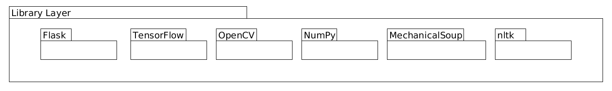

Figura 16. Library layer

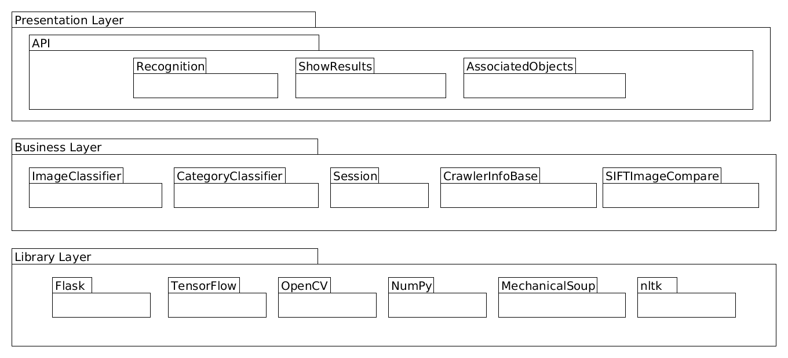

Figura 17. Schema riassuntivo della decomposizione in sottosistemi
dell'applicazione.

## Diagramma di deployment

Dal punto di vista architetturale si nota che i *tier* dei servizi sono
propriamente fisici e sono esterni alla progettazione del sistema:
saranno però interpellati dai *crawler* per ottenere le informazioni sui
servizi richiesti dal *client*.

Si mostra in maniera semplificata l\'interazione mediante l\'interfaccia
REST-Like che avviene tra il *backend* che è un *tier* fisico a se ed i
vari *client*, come ad esempio il *browser*.

Sul *backend* saranno quindi presenti i livelli *presentation*,
*business* e *library,* mentre, sul *frontend* dovrà essere presente
almeno un layer di *presentation* che consente la comunicazione con il
*backend*.

Figura 18. Diagramma di deployment

## Esempio d'uso del sistema

Di seguito sono riportati gli screen dei *task* principali
dell'applicazione funzionante in cui si è svolta una ricerca caricando
l'immagine di un fiore. Si può notare come AISearchImage è stato in
grado sia di riconoscere l'elemento e sia di proporre elementi simili
per l'acquisto.

Figura 19. Primo task. In questa interfaccia l'utente può caricare
un'immagine da esaminare

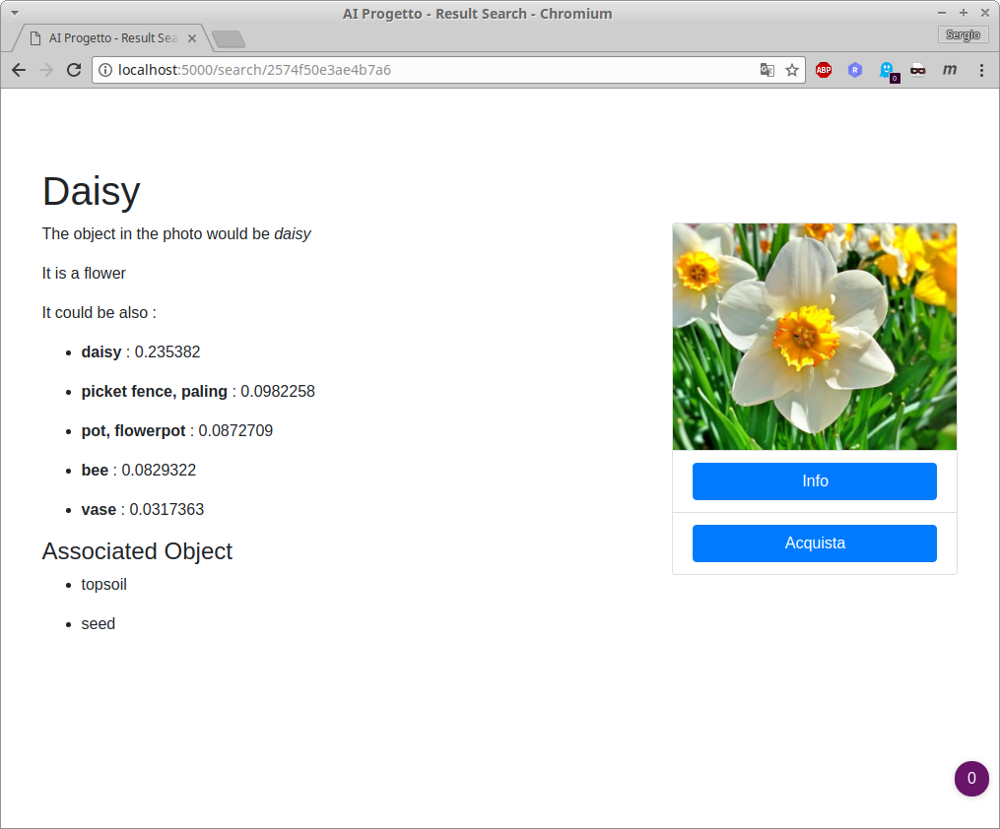

Figura 20. Secondo task. Viene mostrato all\'utente la categoria
dell'immagine con i relativi oggetti associati. L'utente può scegliere
di avere informazioni o di acquistare un prodotto simile a quello
dell'immagine

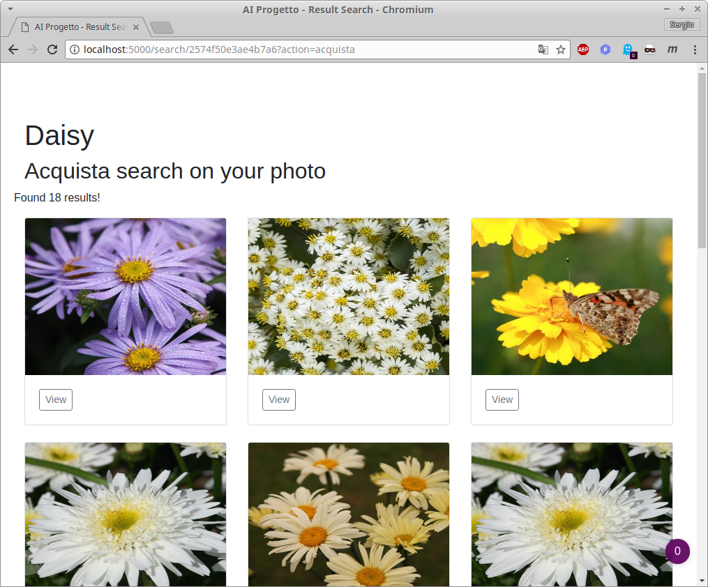

Figura 21. Terzo task. All\'utente viene mostrata una lista di tutti gli
oggetti simili che AISearchImage è riuscito ad estrapolare.

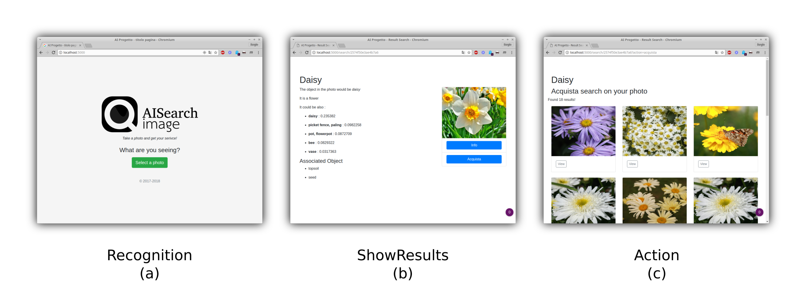

Figura 22. Figura riassuntiva dei task

# Bibliografia e Sitografia

\[1\] https://dl.acm.org/citation.cfm?id=104377

\[2\] http://ieeexplore.ieee.org/document/6296526/authors

\[3\] http://shop.oreilly.com/product/0636920063698.do

\[4\] https://arxiv.org/pdf/1512.00567.pdf

\[5\] https://github.com/tensorflow/models/tree/master/research/inception

\[6\] https://www.tensorflow.org/tutorials/image_recognition
